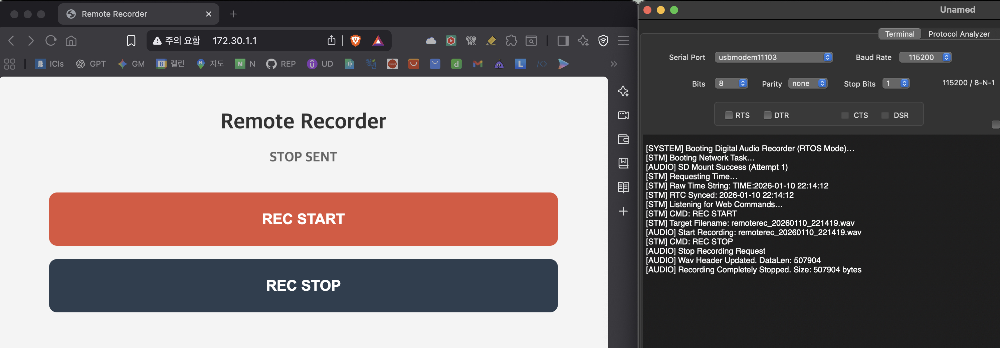
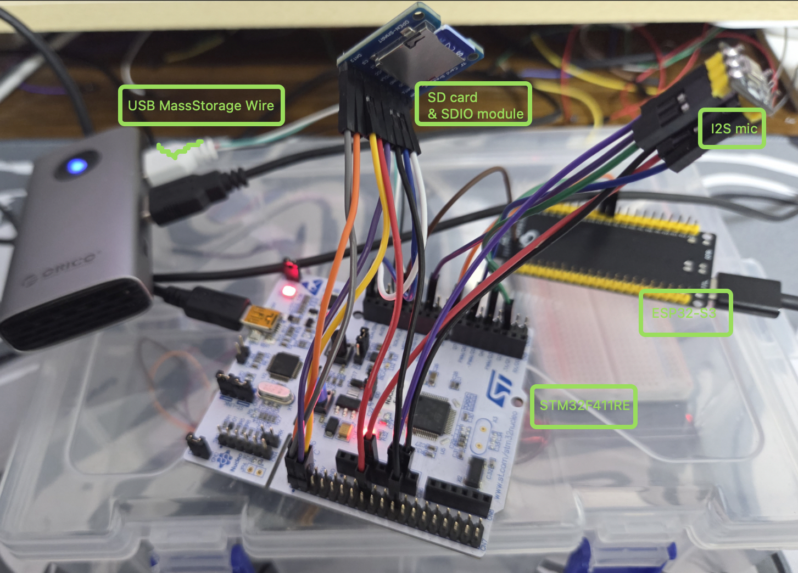
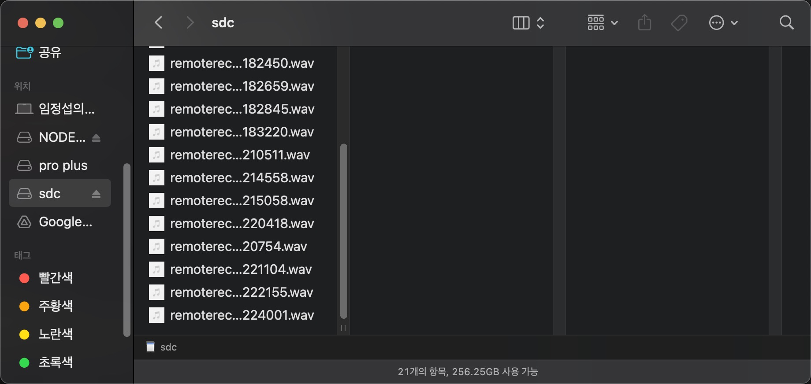
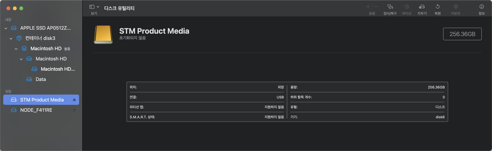
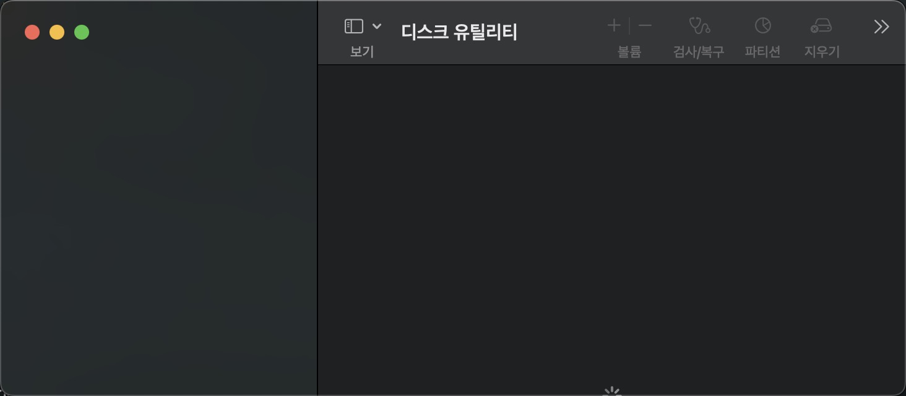

# Remote Voice Recorder 

STM32F411 Nucleo를 기반으로 구현한 원격 음성 녹음기 프로젝트다.  
ESP32-S3를 통한 비동기 웹 서버 제어와 STM32의 USB Mass Storage 기능을 결합하여 원격 녹음 및 데이터 관리를 진행했다.

## 주요 기능

1. **원격 녹음 제어 및 웹 인터페이스**
   - **ESP32 Web Server**: ESP32-S3 내부에 `ESPAsyncWebServer` 및 `AsyncTCP` 라이브러리를 활용한 비동기 웹 서버를 구축했다. 해당 웹 페이지에서는 스마트폰이나 PC 웹 브라우저를 통해 원격으로 녹음을 시작하고 중지할 수 있는 인터랙티브 인터페이스를 제공한다.
   - **High-Speed UART**: STM32와 ESP32-S3 간 1Mbps UART 통신을 통해 제어 명령을 지연 없이 전달한다.

2. **고속 오디오 처리 및 저장**
   - **Audio Quality**: I2S 인터페이스를 통해 16kHz, 16-bit 모노 품질로 오디오를 샘플링한다.
   - **Data Path**: DMA를 활용하여 CPU 개입 없이 데이터를 메모리로 전송하며, Double Buffering 구조를 통해 실시간 쓰기 작업 중 데이터 유실을 방지했다.
   - **Storage**: SDIO 4-bit 모드로 256GB 삼성 Pro Plus SD카드(exFAT)에 고속으로 데이터를 기록한다.

3. **USB Mass Storage (MSC) 구현**
   -  별도의 SD카드 분리 없이, 기기를 PC(Mac/Windows)에 USB로 연결하면 즉시 이동식 디스크로 인식된다.

4. **시스템 아키텍처**
   - **Dual-Core 협업**: 실시간 제어 및 오디오 처리는 STM32가 전담하고, 네트워크 스택은 ESP32-S3가 전담하여 상호 간섭을 최소화했다.
   - **Real Time Sync**: 부팅 시 ESP32-S3으로부터 NTP 시간(한국 표준 시)을 수신하여 시스템 시계(STM32 RTC)를 사용해 실제 한국 시각과 동기화하며, 파일명에 정확한 녹음 시작 시각을 반영한다.

## 기술적 세부 구현 사항

프로토타입 환경(배선이 점퍼 와이어)의 물리적 제약을 극복하기 위해 다음과 같은 저수준 최적화를 수행했다. STM32F411RE의 데이터시트와 유저매뉴얼을 적극 참고했다.

- **SDIO 신호 안정화**: 신호 간섭과 노이즈를 억제하기 위해 SDIO 통신 클럭을 1MHz로 분주(`ClockDiv = 48`)하고, 모든 데이터/명령 라인에 내부 풀업 저항(`GPIO_PULLUP`)을 활성화했다.
- **RX Overrun 방지**: USB 통신 부하가 높을 때 데이터 유실을 막기 위해 **Hardware Flow Control**을 활성화하여 하드웨어 레벨에서 전송 속도를 자동 제어한다.
- **메모리 정렬**: SDIO DMA 전송의 무결성을 위해 오디오 버퍼 및 파일 시스템 객체를 4바이트 단위로 강제 정렬(`__attribute__((aligned(4)))`)했다.
- **데이터 무결성**: 녹음 종료 시 `f_sync`를 호출하여 SD카드의 물리적 섹터에 데이터를 확실히 기록함으로써 파일 깨짐 현상을 방지했다.

## 하드웨어 / 개발 환경 구성

- **Main MCU**: STM32F411RET6 (Nucleo-F411RE)
- **Network MCU**: ESP32-S3 DevKit
- **Audio Input**: I2S MEMS Microphone (INMP441)
- **Storage**: Micro SD Card (Samsung Pro Plus 256GB)
- **Interface**: USB OTG (PA11/PA12)

- **Develope / File Vertification PC**: Macbook pro M3 pro (macOS)  **Develop IDE**: STM32 CubeIDE / STM32 CubeMX / ArduinoIDE

## 하드웨어 검증 환경

본 프로젝트의 모든 기능은 다음 환경에서 검증되었다.

- **Storage Verification**: 256GB exFAT SD카드를 MBR 방식으로 포맷하여 호환성을 확보했다. (STM32-macOS 호환성 때문)
- **PC 연동**: macOS 환경에서 Finder를 통한 파일 탐색 및 Disk Utility(디스크 유틸리티 앱)를 활용한 장치 인식 및 복구 프로세스를 거쳐 USB MSC 동작을 확인했다.

## SDIO/USB MSC 구현 첨언

USB MSC 구현을, 맥북의 디스크유틸리티앱 에서 STM Product Media라는 디스크 이름으로 인식은 시켰으나, 원인 미상의 이유로 "녹음 직후" USB MSC Wire을 맥북에 연결 시 디스크유틸리티에서 무한로딩이 걸리며 USB MSC 인식이 되지 않는다.
 
그래도 SDIO를 통한 SD카드에 녹음 데이터 저장은 정상적으로 이루어져, 맥에 SD카드를 직결했을 경우 녹음된 WAV파일들이 잘 보인다.

